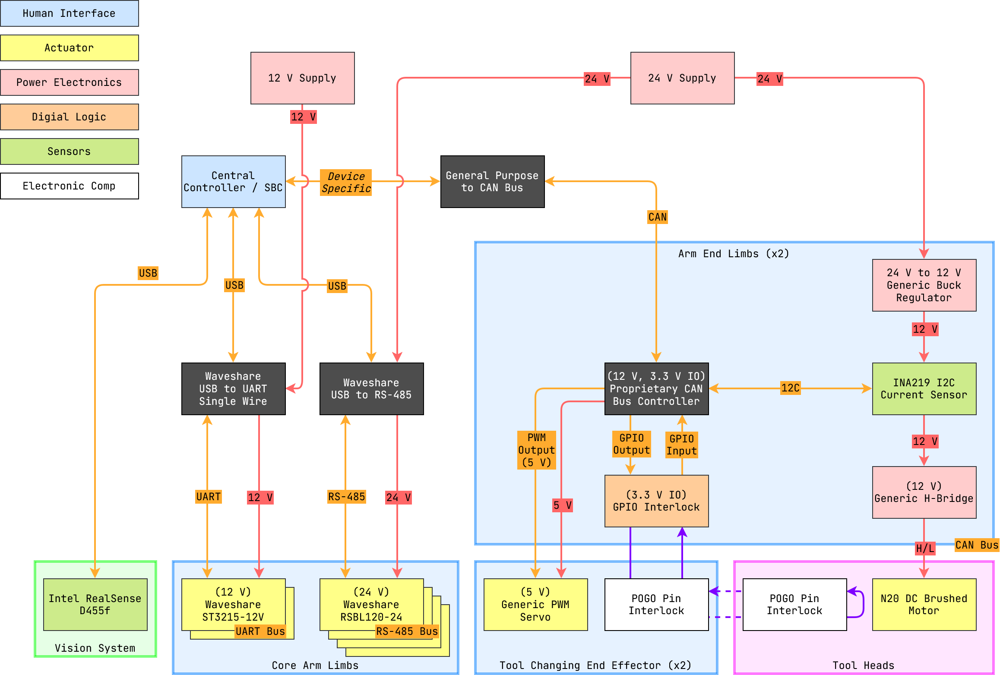

# capstone2026

Robot arm Mechatronics undergraduate capstone project.

  
Table of Contents

---

<!-- TOC -->
* [capstone2026](#capstone2026)
  * [1 Overview](#1-overview)
    * [1.1 Bill of Materials (BOM)](#11-bill-of-materials-bom)
    * [1.2 Block Diagram](#12-block-diagram)
  * [2 Setup and Calibration Scripts](#2-setup-and-calibration-scripts)
  * [3 Manual Hardcoded Configs](#3-manual-hardcoded-configs)
  * [4 Runnables](#4-runnables)
<!-- TOC -->

---

## 1 Overview

### 1.1 Bill of Materials (BOM)

| Manufacturer Part Number | Manufacturer | Description       | Quantity | Notes |
|--------------------------|--------------|-------------------|---------:|-------|
| RSBL120-24               | Waveshare    | RS-485 24 V Motor |        4 |       |
| ST3215-12V               | Waveshare    | UART 12 V Motor   |        2 |       |
| CAN Controller           |              | CAN Controller    |        2 |       |
| Intel RealSense D455f    | RealSense    | Depth Camera      |        1 |       |

### 1.2 Block Diagram

> Drawio file here: [capstone2026.drawio](docs/capstone2026.drawio).

---

## 2 Setup and Calibration Scripts

[`motor_id.py`](drivers/motor_id.py)

[`calibrate.py`](computer_vision/calibrate.py)

---

## 3 Manual Hardcoded Configs

[`end_effectors.py`](robot/end_effectors.py)

[`motor_joints.py`](robot/motor_joints.py)

[`constants.py`](constants.py)

---

## 4 Runnables

[`main.py`](main.py)

[`demo_april_tag.py`](demo_april_tag.py)

[`demo_run_tool.py`](demo_run_tool.py)

[`demo_tool_changer.py`](demo_tool_changer.py)
